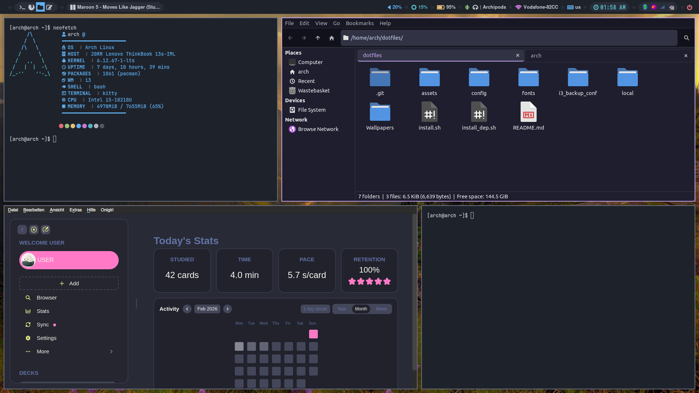
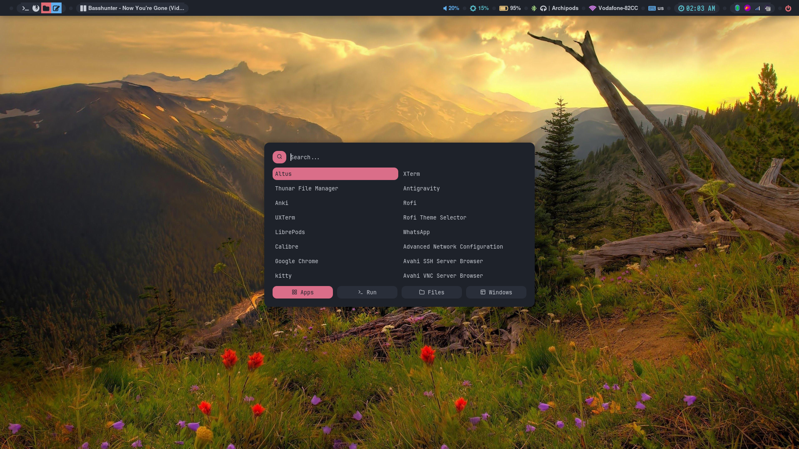

# My Arch i3 Rice

A lightweight, beautiful, and functional i3wm setup based on Catppuccin Mocha.

## Screenshots




## Features
- **Window Manager**: i3-wm (with gaps and rounded corners via picom)
- **Bar**: Polybar (Catppuccin theme)
- **Launcher**: Rofi
- **Notifications**: Dunst
- **Keybindings**: Hyprland-like workflow with consistent shortcuts
- **Gestures**: 3-finger and 4-finger swipe support

## Quick Install (Recommended)

1.  **Install Packages**:
    ```bash
    ```bash
    # Install all dependencies (Official + AUR)
    chmod +x install_dep.sh
    ./install_dep.sh
    ```

2.  **Run Install Script**:
    This script will safely backup your existing configs (creating `_backup`, `_backup1`, etc.) and install the new ones.
    ```bash
    chmod +x install.sh
    ./install.sh
    ```

3.  **Final Setup**:
    ```bash
    # Setup Gestures group
    sudo gpasswd -a $USER input
    
    # Enable Gestures
    libinput-gestures-setup start
    ```

4.  **Restart**:
    Log out and log back in (or reboot) to apply changes and group permissions.

## Backup Logic
The `install.sh` script checks for existing configurations. If any conflicts are found (`~/.config/i3`, etc.), it moves ALL conflicting items to a new backup set with a unique suffix (e.g., `_backup`, `_backup1`, `_backup2`) so you never lose your old data.

## Keybindings Cheat Sheet
See `config/i3/config` for the full list.
- `Super + Return`: Terminal
- `Super + Space`: Launcher
- `Super + W`: Browser (Brave)
- `Super + T`: Telegram
- `Super + D`: TickTick
- `Super + A`: Anki
- `Super + C`: Custom Code Editor
- `Super + V`: Clipboard History
- `Super + Shift + C`: Color Picker
- `Super + Shift + X`: OCR Selection

Reload i3 (`Super+Shift+R`) or reboot.

Enjoy!
