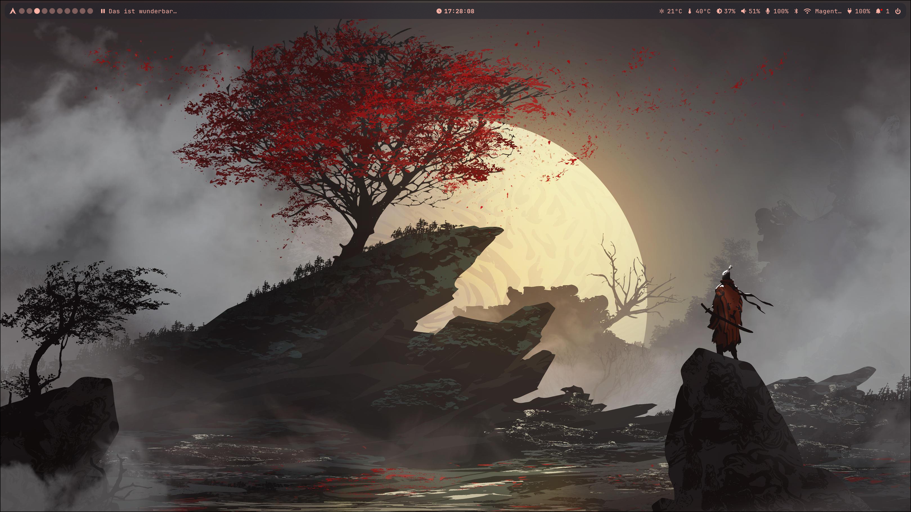
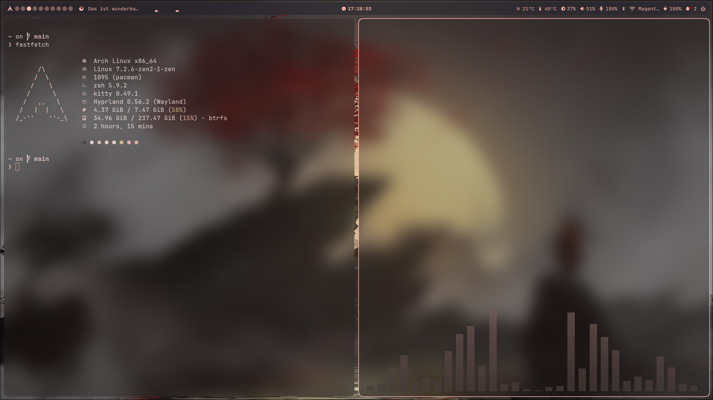
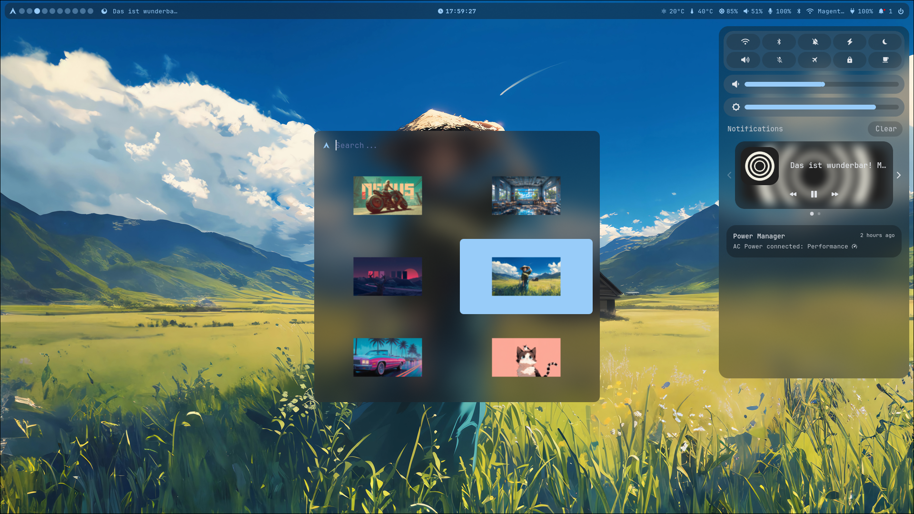
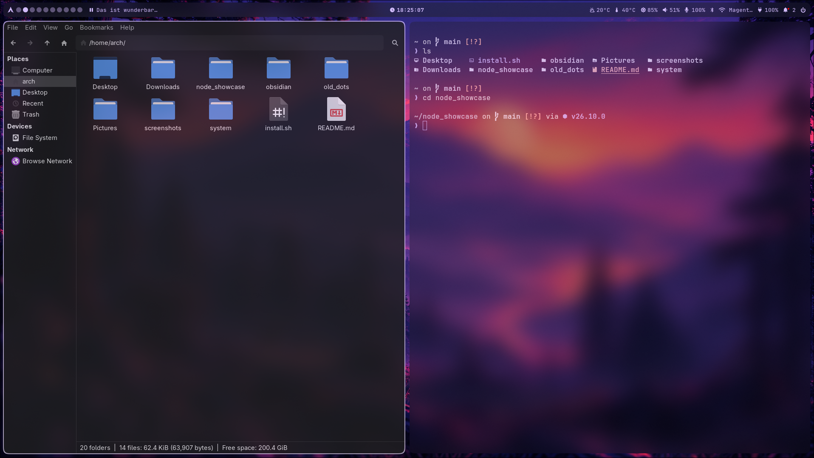
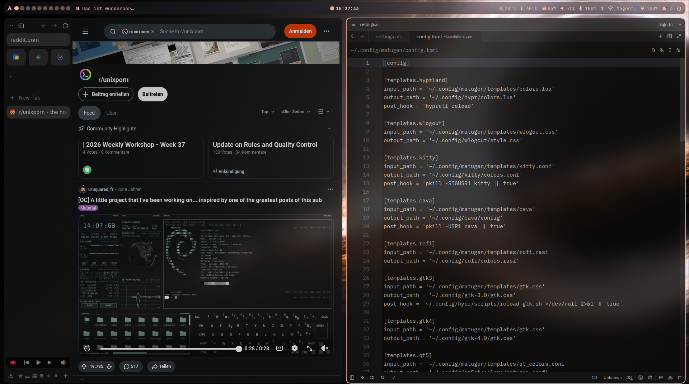
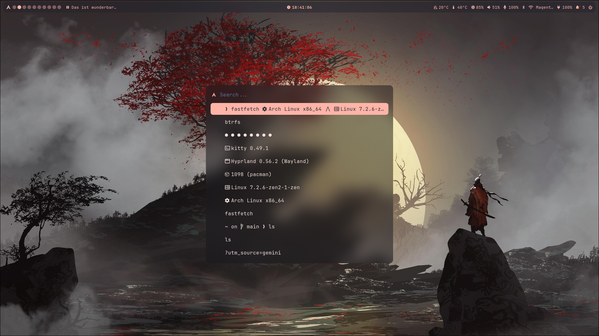
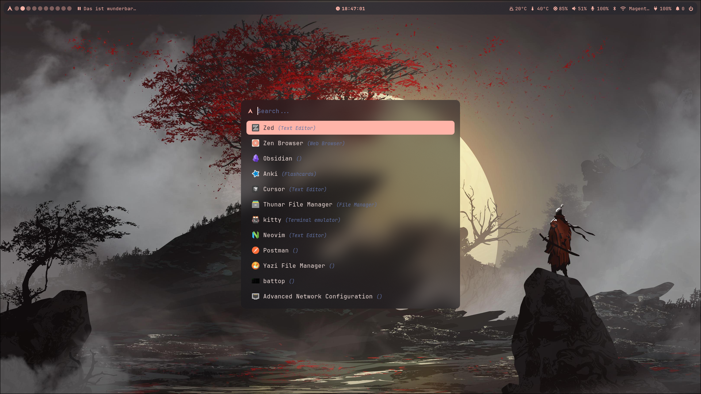

<p align="center">
  
  
  
</p>

<h2 align="center">
  
  Arch Hyprland Dotfiles
  
</h2>

---

<p align="center"><i></i></p>

---

<h2 align="center">
  
  Showcase
  
</h2>

<details open>
  <summary><b>Click to collapse/expand screenshots</b></summary>

  <br>

  <!-- Add your screenshots here -->
  <p align="center"></p>
  <p align="center"></p>
  <p align="center"></p>
  <p align="center"></p>
  <p align="center"></p>
  <p align="center"></p>

</details>

---

## 🚀 Quick Installation

Clone the repository and run the installation script:

```bash
git clone https://github.com/devnazarchuk/dotfiles.git
cd dotfiles
chmod +x install.sh
./install.sh

```

Or use the interactive menu / flags (`./install.sh --help`).

---

## 🛠️ Stack & Tools

* **Window Manager:** Hyprland (Wayland)
* **Bar:** Waybar
* **Launcher:** Rofi / Fuzzel
* **Terminal:** Kitty / Alacritty
* **Shell:** Zsh + Starship
* **Editor:** Neovim / Zed
* **Theme:** Catppuccin Mocha

---

## 🎨 Credits & Inspirations

* **Grub Theme:** [ivanimmanuel-dev/grub-of-tsushima](https://github.com/ivanimmanuel-dev/grub-of-tsushima)
* **SDDM Theme:** [Keyitdev/sddm-astronaut-theme](https://github.com/Keyitdev/sddm-astronaut-theme)
* **Inspired by:** [xarefin/dotfiles](https://github.com/xarefin/dotfiles)
* **Zed Theme:** [k4yt3x/zed-theme-ayu-darker](https://github.com/k4yt3x/zed-theme-ayu-darker/)
